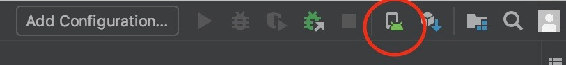
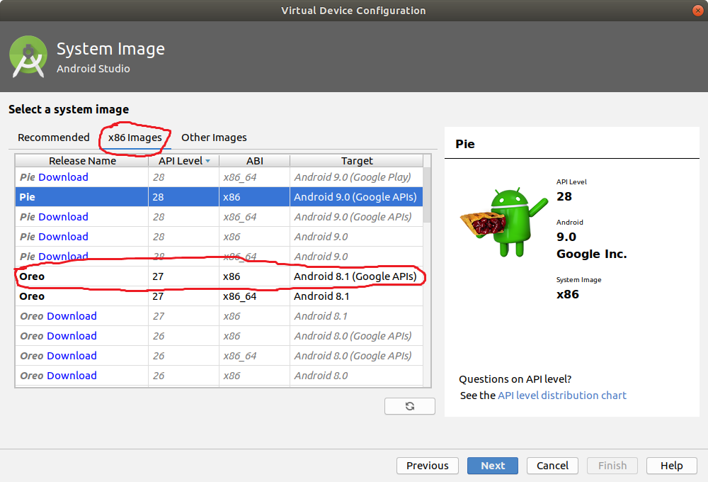

# Setup of Mobile App and Backend

This document guides you through the setup of our mobile app and the corresponding backend.

## Software Artifacts

This sections gives an overview of all software artifacts that are needed to setup our mobile app and the corresponding backend.
Each software artifact can be found inside the same folder as this setup guide.

### backend.zip

The backend.zip contains all software artifacts needed to deploy the backend for our mobile app.

### mobileapp.zip

The mobileapp.zip contains all software artifacts needed to build and execute our mobile app.

## Backend

_Author:  A. Schürer_

### Abstract definition

Create a Ubuntu Linux Virtual Machine on AWS EC2, install Docker and open port 8080 for TCP connections.

The backend is empowered by an Node.js Express.js web server in combination with a mongoDB.
Both the web server and the database are shipped in their own container.
The containers are based on [Docker](http://www.docker.com) and the deployment is managed by [Docker Compose](https://docs.docker.com/compose).
You can run these containers anywhere with docker installed.
We recommend you to use [Ubuntu](http://www.ubuntu.com) 18.04-LTS, Docker 18.09.0 and host the backend on [AWS EC2](https://aws.amazon.com/ec2) with *t3.medium* size.
The VM has to be accessible over TCP on port 8080.
The following steps describe how to create an Ubuntu VM with Docker using [docker-machine](https://docs.docker.com/machine).

#### Docker
Install [Docker](https://docs.docker.com/install) 18.09.0 on your local computer in order to use the docker-machine commands.

#### Docker Compose
On Windows and Mac docker-machine and docker-compose is automatically installed along with Docker.
If you are using Linux, install [docker-machine](https://docs.docker.com/machine/install-machine) and [docker-compose](https://docs.docker.com/compose/install) on your local computer.

#### Extract backend.zip
Extract the *backend.zip*, which can be found inside the same folder as this setup guide, into a new directory named *pastub2019backend*.
Run all following commands inside the *pastub2019backend* directory.

#### VM
Create a Ubuntu 18.04-LTS Virtual Machine with the size *t3.medium* using docker-machine.
Insert your AWS Access Key ID at *yourAWSAccessKeyID* and your AWS Secret Access Key at *yourAWSSecretAccessKey*.
On Linux and Mac you maybe need to execute the commands with sudo privileges.

```sh
docker-machine create --driver amazonec2 --amazonec2-access-key yourAccessKeyHere --amazonec2-secret-key yourSecretKeyHere --amazonec2-ami ami-0bdf93799014acdc4 --amazonec2-instance-type t3.medium --amazonec2-open-port 8080 --amazonec2-region eu-central-1 pastub2019
```

Set your docker-machine environment variables to the AWS VM on Linux and Mac.

```sh
eval $(docker-machine env pastub2019)
```

on Windows.

```sh
@FOR /f "tokens=*" %i IN ('docker-machine env pastub2019') DO @%i
```

#### Start the application
Start the application.
Run this and all following commands inside the *pastub2019backend* directory.

```sh
docker-compose build
docker-compose up -d
```

#### IP
Obtain the public IP of your AWS EC2 VM.

```sh
docker-machine ip pastub2019
```

#### Backend check
Send a request to your backend hosted on your AWS EC2 VM to check if the backend is running.

```sh
curl -X GET $(docker-machine ip pastub2019):8080
```

The backend is working when the cURL request returns a greeting message

**Hint**: If the cURL request is not working, manually insert the IP of the backend that you obtained from the docker-machine ip pastub2019 into the cURL request.
If it's still not working, try to send the request with Postman.

#### Stop backend
**Optional**: If you want to stop the backend when you don't need it anymore, run the following command.
```sh
docker-machine stop pastub2019
```

In the next section we guide you through the setup of the mobile app.

## Mobile App

_Authors: D. Bosin, A. Schürer, S. Lienau, A. Dittmann_

### Abstract definition

Install Java, Node.js, npm, React Native, Android Studio and SDK.
Set the IP of the backend.
Build and execute the android app on android virtual device (AVD).

### Installing dependencies

The following steps describe how to install the dependencies for building and executing the android app.
These steps are basically taken from the [React Native Getting Started Guide](https://facebook.github.io/react-native/docs/getting-started.html), so alternatively you could also follow the steps there by chosing `Building Projects with Native Code` first and then select your operating system as development OS and `Android` as target OS. **In this guide we will describe how to setup the environment for Linux only. To setup your development environment for macOS and Windows we refer to the [React Native Getting Started Guide](https://facebook.github.io/react-native/docs/getting-started.html).**

#### Node

Install [Node.js](https://nodejs.org/en/download) 10.15.3 LTS and [npm](https://www.npmjs.com/get-npm) 6.8.0.

#### The React Native CLI

Install the React Native command line interface via the node package manager. We are using version _0.58.4_. You may need to execute the commands with sudo privileges.

```sh
npm install -g react-native-cli
```

#### Java Development Kit

Install one of either [Oracle JDK 8u201](http://www.oracle.com/technetwork/java/javase/downloads/jdk8-downloads-2133151.html) or [OpenJDK 8](http://openjdk.java.net/install/). Make sure you install the Java Development Kit (JDK), and not only the Java Runtime Environment (JRE).

#### Android Studio

1. **Install [Android Studio](https://developer.android.com/studio/install)**  
Choose "custom" setup and make sure the `Android SDK`, `Android SDK Platform` and `Android Virtual Device` options are checked.  
In the installation process you may be asked to install KVM. This is not necessary but significantly raises the emulator's speed. For installing KVM, we refer to the android developer guide: https://developer.android.com/studio/run/emulator-acceleration?utm_source=android-studio#vm-linux.  
_**Note**: Installing KVM may differ in each linux distribution and version. For example, we had no problems installing KVM on a Manjaro system. The installation on Ubuntu 18.04 LTS however did not work flawless and we had to invest some time in fixing the occured problems. An incomplete KVM installation may also produce other problems, e.g. not being able to start the "AVD Manager" of Android Studio. Thus, we cannot guarantee a flawless installation process for KVM and the installation of KVM happens "at the user's own risk"._

2. **Install [Android SDK](https://developer.android.com/studio/intro/update) 8.1 (Oreo)**  
This can be done by using the Android Studio SDK Manager. The SDK Manager can be accessed from the "Welcome to Android Studio" screen. Click on "Configure", then select "SDK Manager".  
Select the "SDK Platforms" tab from within the SDK Manager, then check the box next to "Show Package Details" in the bottom right corner. Look for and expand the `Android 8.1 (Oreo)` entry, then make sure the following items are checked:

    * `Android SDK Platform 27`
    * `Intel x86 Atom_64 System Image` and `Google APIs Intel x86 Atom System Image`  
Click on the "Apply" button to install the selected components.

3. **Configure the `ANDROID_HOME` environment variable**  
Add the following lines to your `$HOME/.bash_profile` config file (create it, if not already existing):
    ```sh
    export ANDROID_HOME=$HOME/Android/Sdk
    export PATH=$PATH:$ANDROID_HOME/emulator
    export PATH=$PATH:$ANDROID_HOME/tools
    export PATH=$PATH:$ANDROID_HOME/tools/bin
    export PATH=$PATH:$ANDROID_HOME/platform-tools
    ```
    _**Note**: If you only add these lines to the `$HOME/.bash_profile` file, you will have to import these settings into every terminal session by executing `source $HOME/.bash_profile`. If you also add the above lines into your `$HOME/.bashrc` file, your terminal will automatically import these settings on start up (i.e., you still have to restart your terminal once)._

#### Watchman

Install [Watchman](https://facebook.github.io/watchman/docs/install.html#buildinstall). This is not required but highly recommended by React Native.

### Run the application

#### Preparing an android virtual device

_**Note**: You can also use a physical android device for development purposes. For more information we refer to the [React Native Getting Started Guide](https://facebook.github.io/react-native/docs/getting-started.html)._

To create an Android Virtual Device, you have to start the **AVD Manager** first. The AVD Manager can be accessed from the "Welcome to Android Studio" screen. Click on "Configure", then select "AVD Manager".  
Alternatively, if you already have an opened project, you can start the AVD Manager by clicking this icon inside Android Studio:  
  
_**Warning**: If starting the AVD Manager fails, or you get an error saying that Android Studio has no permission to access `/dev/kvm`, execute the following command and then restart Android Studio: `sudo setfacl -m u:$USER:rwx /dev/kvm`_  
The creation of new virtual devices is well described on the [Android Studio Documentation](https://developer.android.com/studio/run/managing-avds). Although you can choose any virtual phone, we recommend the **Nexus 5X**. It is important though that you install the required Android SDK that we use in our project, which is **Android 8.1 (Oreo)** and **API Level 27**. The target also needs support for Google APIs as indicated in the "Target" column.


#### Running the virtual device

The recently created virtual device can be started from the **AVD Manager**. It is important that the Virtual Device is running and that the environment variables from the previous section are available _before_ the mobileapp is started.

#### Extract and configure the mobileapp

1. Extract the `mobileapp.zip`, which can be found inside the same folder as this setup guide. Run all following commands inside the extracted directory.

2. Open the file `src/lib/config.json` inside the extracted folder and add the IP you obtained from docker-machine ip pastub2019.
Don't add a prefix like *http* in front of the IP and don't add a suffix like a port to the IP.

    ```js
    export default {
        apiEndpoint: 'x.x.x.x',
    }
    ```

**_Hint_**: If you don't add your own IP, you are using the backend of the PAS team.

#### Install the project dependencies

Run the following command from inside the extracted directory:  

```sh
npm install
```

#### Start the app

Run the following commands from within the extracted directory:

1. Run the package server  

    ```sh
    npm start
    ```
    **Known issue:** If you installed watchman, the above command may fail saying that a file named `.watchmanconfig` is missing. To fix         this issue just create the file, e.g. with `touch .watchmanconfig`.

2. From another shell, run (deploy) the mobile app onto the virtual device

    ```sh
    react-native run-android
    ```
    **Know issue:** If you installed watchman and the app is stuck at 0% loading the `index.js`, execute the following and try                  again:
    ```
    echo 999999 | sudo tee -a /proc/sys/fs/inotify/max_user_watches
    echo 999999 | sudo tee -a /proc/sys/fs/inotify/max_queued_events
    echo 999999 | sudo tee -a /proc/sys/fs/inotify/max_user_instances
    watchman shutdown-server
     ```

_**Hint**: If the application doesn't start on the virtual device, make sure that you set the environment variables correctly._

#### Use the app

When you start the app for the first time, you need to log in.
Enter `admin` as username and `adminiscooler` as password. Also make sure to allow the app to use the emulators location and set the emulators location to a location in Berlin. (e.g. 52.5140, 13.3350). It possibly happens, that some markers on the map are not displayed correctly (indicated by the "default" red Google Maps Markers). To fix issue just reload the app by either double pressing `R` or pressing `Ctrl+M` and selecting "Reload" in the pop up menu.
